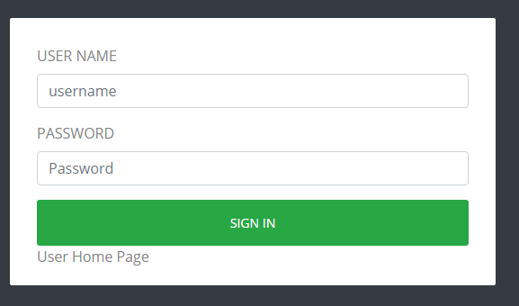
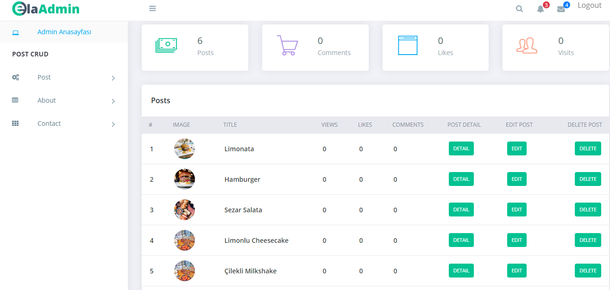
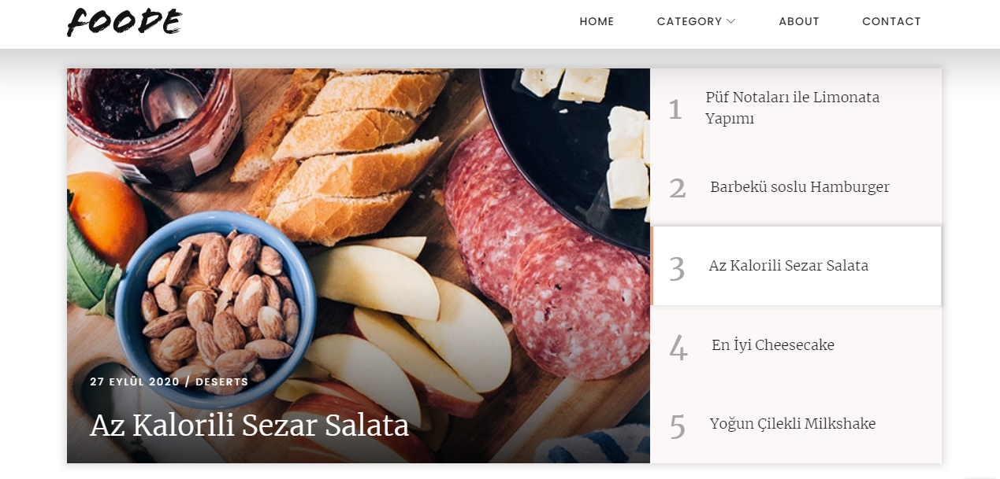
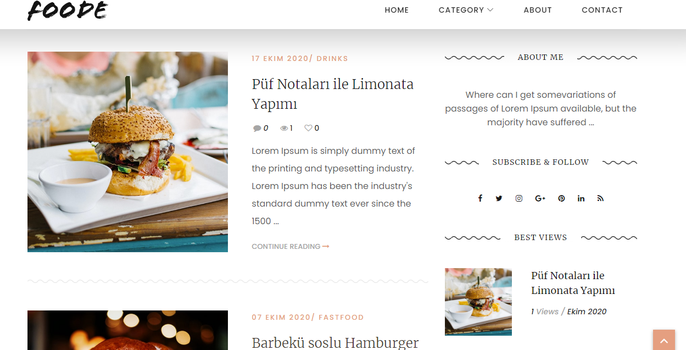
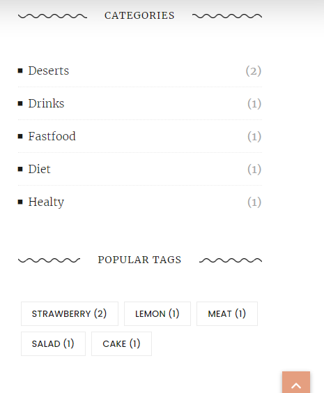
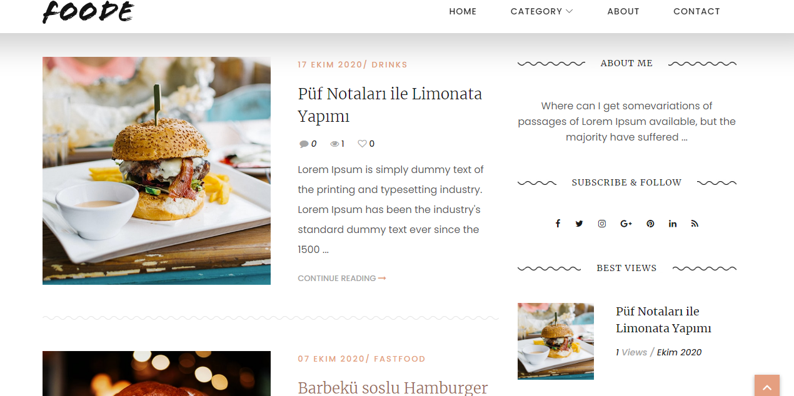
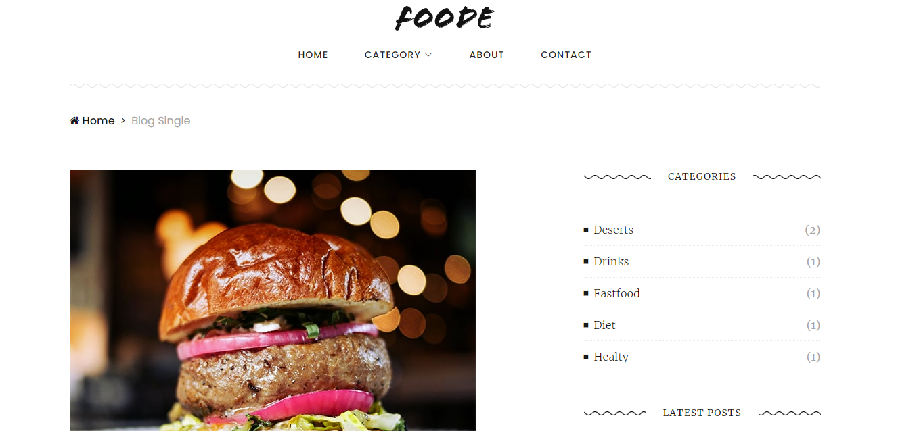
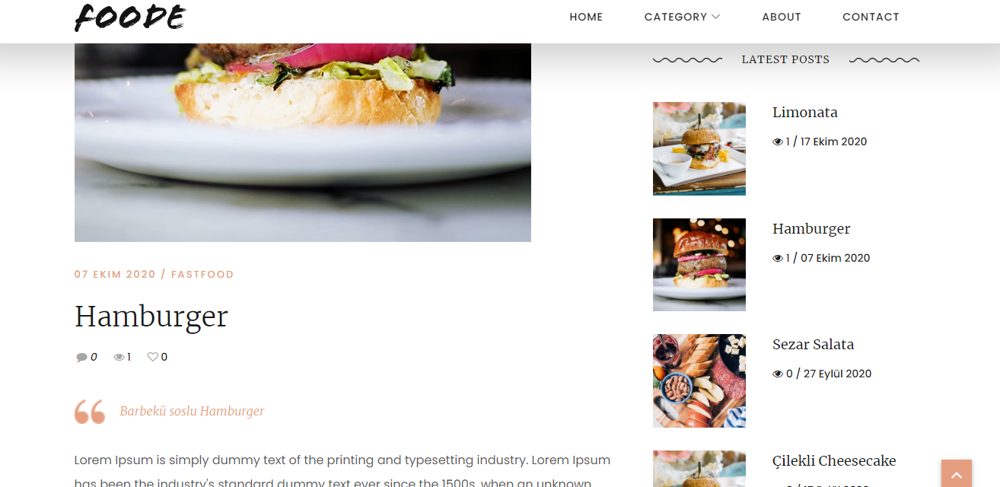
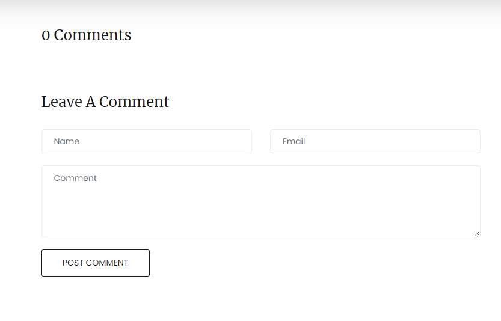

# KuskonmazBlog
.net Core, MVC, Simple Blog

This blog project has  user pages and and admin management pages for CRUD operations. 

It is a project that has deficiencies and needs to be developed.

I worked on it to improve my .net Core, Entity Framework, Unit Of Work Design Pattern knowledge and skills.

In the project, there are areas that can be accessed by the administrator panel, which can be accessed by the site authority, or according to the user role.

Some data will be filled in SeedData.cs

I used 2 different free templete  for admin panel and user pages.

For admin login; username:nigarozluk , password:123456

 
 
<h1>Admin Panel:</h1>
 
 

 
 
<h1>Blog HomePage:<h1>
 
 

 
 

 
 

 
 

 
 

 
 
<h1>Blog Single(Post Details)<h1>
 
 

 
 

 
 

 
 
